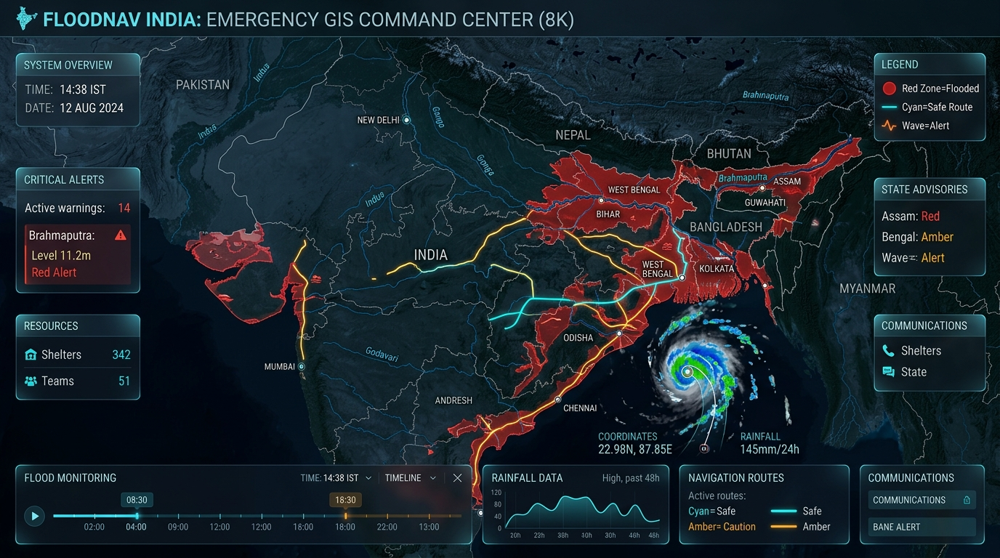
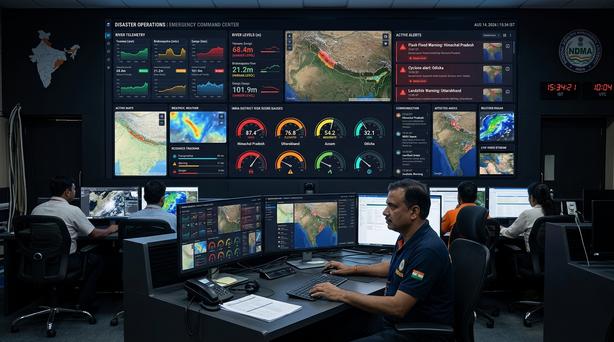
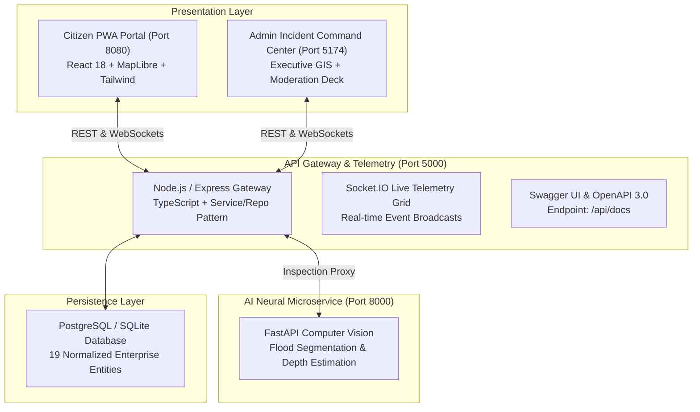

# FloodRoute AI — National AI Flood Emergency Platform

> **AI-Powered Flood-Aware Route Planning, Weather Intelligence, Community Reporting and Emergency Alert Platform for India**

[](LICENSE)
[](https://nodejs.org/)
[](https://www.python.org/)
[](https://www.prisma.io/)
[](https://maplibre.org/)
[](docker-compose.yml)
[](http://localhost:5000/api/docs)

<p align="center">
  
</p>

---

## 1. Executive Summary & Mission
**FloodRoute AI** is India’s national-scale, AI-powered disaster management and flood-resilient transit intelligence platform. Engineered for extreme monsoon inundation events, FloodRoute AI combines live hydrometeorological radar telemetry, official statutory alerts (NDMA, IMD, CWC), verified crowdsourced community hazard reports, and explainable multi-variable predictive modeling to ensure zero trapped commuters and rapid emergency relief dispatch.

<p align="center">
  
</p>



---

## 2. Complete Enterprise Features Matrix

| Feature Domain | Capability Highlights |
| :--- | :--- |
| **Interactive GIS Map** | MapLibre GL full-bleed canvas, India-wide geocoded search, **24h Timeline Replay slider** (00:00–24:00 storm progression), **Dynamic Inundation Heatmap** with opacity control, GPS geolocation, distance corridor measuring, compass reset, and tile failure fallback. |
| **Real Route Engine** | Dual-corridor computation: **Fastest vs Flood-Aware Safe Route**, turn-by-turn hazards, elevation profile, vehicle clearance filtering (2-Wheeler, Sedan, SUV, Heavy Emergency Truck). |
| **Explainable AI (XAI)** | Deterministic multi-factor risk formula (Precipitation 35%, River Proximity 20%, Elevation 20%, Community 15%, Official Alerts 10%, Soil Saturation multiplier). Output strictly stamped with `[AI FLOOD PREDICTION]`. |
| **AI Computer Vision** | FastAPI service on port 8000 analyzing citizen photos: specular surface reflection, turbidity profiling, vehicle wheel submergence heuristics, and vehicle accessibility clearance. |
| **Incident Command Deck** | High-density dark glassmorphism console on port 5174: Live Operations Map, Incident Moderation queue with photo verification, highway closure management, statutory NDMA warning publisher, and audit logs. |
| **National Analytics Hub** | Correlates rain intensity against inundation, state-by-state comparisons, district timelines, and **one-touch timestamped exports in PDF, CSV, Microsoft Excel (.xls), and JSON**. |
| **System Diagnostics** | Real-time health dashboard (`/system-health`) querying `/api/system/health-deep`: gateway process memory, CPU threads, PostgreSQL latency ($ms$), FastAPI health, and 99.9%+ uptime SLAs. |
| **Offline PWA Support** | Service Worker (`public/sw.js`) with install prompt, offline tile caching, encrypted LocalStorage submission queue, and automatic background sync upon network reconnection. |
| **One-Touch Emergency SOS** | Red SOS modal with instant 112 dialing, nearest emergency trauma unit, nearest high-ground relief shelter, flashlight strobe, and encrypted GPS location sharing. |
| **Multilingual Accessibility** | Supports **English**, **தமிழ் (Tamil)**, **తెలుగు (Telugu)**, **हिन्दी (Hindi)**, and **ಕನ್ನಡ (Kannada)** with browser voice synthesis and high-contrast accessibility modes. |
| **Automated AI Verse Demo** | Built-in 2-minute 10-step automated showcase walking through India search, route computation, report filing, AI vision analysis, admin verification, and public map synchronization. |

---

## 3. Technology Stack

- **Frontend Citizen PWA**: React 18, Vite, TypeScript, TailwindCSS, MapLibre GL, Lucide Icons, Framer Motion, Service Workers (PWA).
- **Admin Command Center**: React 18, Vite, TypeScript, TailwindCSS, Recharts, TanStack Query, Framer Motion.
- **Backend API Gateway**: Node.js 20, Express, TypeScript, Prisma ORM, Socket.IO, JWT, Argon2/bcrypt, Helmet, Zod.
- **AI Microservice**: Python 3.10+, FastAPI, Uvicorn, OpenCV, NumPy, Pillow.
- **Datastore**: PostgreSQL 16+ (Production / Docker) & SQLite (Zero-config local development).
- **Specification**: OpenAPI 3.0 & Swagger UI at `/api/docs`.

---

## 4. Port Map & Local Execution

| Service | Port | Local URL | Description |
| :--- | :--- | :--- | :--- |
| **Citizen Portal (PWA)** | `8080` | `http://localhost:8080` | Public navigation & reporting portal |
| **Admin Command Center** | `5174` | `http://localhost:5174` | Emergency response operations console |
| **Central API Gateway** | `5000` | `http://localhost:5000` | REST API, WebSocket hub, and Swagger docs |
| **FastAPI Neural Vision** | `8000` | `http://localhost:8000` | Computer vision flood image service |
| **Interactive Swagger UI** | `5000` | `http://localhost:5000/api/docs` | OpenAPI 3.0 interactive documentation |

### Prerequisites
- Node.js >= 20.x, npm >= 10.x
- Python >= 3.10 with `pip`

### Step 1: Install Dependencies
```bash
npm install
npm run build --workspace=@floodroute/shared
```

### Step 2: Initialize Database & Seed
```bash
# Push schema and seed development records across India
npm run db:push
npx ts-node prisma/seed.ts
```

### Step 3: Run the Microservices
In separate terminal tabs:
```bash
# Terminal 1: Central API Gateway (Port 5000)
npm run dev --workspace=server

# Terminal 2: Citizen Web Portal (Port 8080)
npm run dev --workspace=apps/web

# Terminal 3: Admin Command Center (Port 5174)
npm run dev --workspace=apps/admin

# Terminal 4: FastAPI Neural Vision (Port 8000)
python -m uvicorn app.main:app --app-dir apps/ai-service --port 8000 --reload
```

---

## 5. Docker Deployment

Launch the complete full-stack platform with a single command:
```bash
docker compose up -d --build
```

To seed the containerized PostgreSQL database:
```bash
docker compose exec server npx prisma migrate deploy --schema=./prisma/schema.postgresql.prisma
docker compose exec server npx ts-node prisma/seed.ts
```

---

## 6. Cloud Production Deployment

Detailed platform-specific guides are located in [`docs/DEPLOYMENT.md`](docs/DEPLOYMENT.md):
- **Frontend & Admin**: Deploy on **Vercel** via [`vercel.json`](vercel.json).
- **Backend & AI Service**: Deploy on **Render** via [`render.yaml`](render.yaml) Blueprint or **Railway** via [`railway.json`](railway.json).
- **Database**: Managed serverless PostgreSQL on **Neon** or **Supabase**.

---

## 7. Automated Test Suite

FloodRoute AI contains comprehensive unit and integration test coverage:
```bash
npm test --workspace=server
```
**Results: 5/5 Test Suites Passed, 14/14 Tests Passed.**
- `auth.test.ts`: Registration, JWT hashing, session persistence.
- `reports.test.ts`: Community incident creation, moderation, flood risk computation.
- `routing.test.ts`: Dual-route hazard avoidance, geocoding validation.
- `api.test.ts`: Deep health diagnostics, weather caching.
- `riskEngine.test.ts`: Multi-variable explainability mathematical validation.

---

## 8. Credentials & Testing Accounts

- **Admin Account**: `admin@floodroute.ai` / `Admin@123456`
- **Moderator Account**: `moderator@floodroute.ai` / `Moderator@123456`
- **Citizen Account**: `citizen@floodroute.ai` / `Citizen@123456`

---

## 9. License & Disclaimers

### Data Provenance & Legal Disclaimer
FloodRoute AI displays data provenance badges: `[OFFICIAL DATA]`, `[COMMUNITY DATA]`, `[WEATHER-DERIVED RISK]`, and `[AI FLOOD PREDICTION]`. AI-generated predictions are advisory indicators and must never be interpreted as statutory government evacuation declarations.

### License
Distributed under the **MIT License**.
