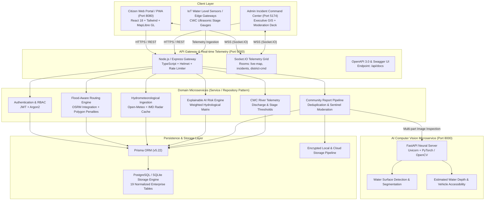

# FloodRoute AI — Enterprise System Architecture Specification

## 1. Executive Summary & Platform Mission
**FloodRoute AI** is India's national-scale AI-powered disaster response, flood-aware route planning, hydrological intelligence, and emergency coordination platform. Built for resilient low-bandwidth operation, real-time spatial awareness, and explainable multi-factor predictive modeling, FloodRoute AI connects citizens, district magistrates, first responders, and emergency command centers during extreme monsoon inundation events.

---

## 2. High-Level Distributed Architecture

---

## 3. Network Architecture & Port Topology

| Service / Workload | Port | Protocol | Technology Stack | High Availability Role |
| :--- | :--- | :--- | :--- | :--- |
| **Citizen PWA Portal** | `8080` | HTTP/HTTPS | React 18, Vite, MapLibre GL, TailwindCSS | Installable Service Worker with offline report buffer |
| **Admin Command Center** | `5174` | HTTP/HTTPS | React 18, Vite, Recharts, Framer Motion | High-density GIS command deck for district magistrates |
| **Central Node.js Gateway** | `5000` | HTTP/REST, WSS | Express, TypeScript, Socket.IO, Prisma | Service/Repository pattern, JWT auth, Swagger docs |
| **AI Computer Vision Service**| `8000` | HTTP/REST | Python 3.11, FastAPI, Uvicorn, Torch, OpenCV | Convolutional flood segmentation and vehicle clearance |
| **Database Engine** | `5432` / Local | TCP / IPC | PostgreSQL 16+ or SQLite with Prisma ORM | 19 relational entities with audit trail and GIS coords |

---

## 4. Key Design Patterns & Engineering Principles

### 4.1. Service / Repository Separation
All backend domain modules (`server/src/*`) strictly decouple database access from business logic:
- **Routes / Controllers (`*.controller.ts`, `*.routes.ts`)**: HTTP transport handling, request validation, response serialization.
- **Services (`*.service.ts`)**: Pure business logic, hydrological weight computations, external API coordination, WebSocket broadcasts.
- **Repositories (`*.repository.ts`)**: Direct Prisma ORM invocations, query filtering, pagination, and transactional atomicity.

### 4.2. Explainable AI (XAI) Hydrometeorological Model
Unlike black-box neural networks, FloodRoute AI's predictive flood risk engine (`@floodroute/shared/src/predictionEngine.ts`) implements an **explainable, deterministic hydrological formula**:
1. **Precipitation Intensity & Forecast (35% weight)**: Current rain gauge rate ($mm/h$) and 24-hour predictive accumulation.
2. **Hydrological & River Proximity (20% weight)**: Distance to major perennial/seasonal waterbodies (CWC stations, Adyar, Yamuna, Brahmaputra).
3. **Topography & Elevation (20% weight)**: Mean Sea Level (MSL) elevation and urban drainage capacity index.
4. **Community Sentinel Reports (15% weight)**: Spatial density of citizen-verified waterlogging points within 1.5 km.
5. **Official Statutory Alerts (10% weight)**: Active NDMA / IMD warnings acting as dynamic risk multipliers.

Every prediction produces a factor contribution percentage breakdown and is strictly labeled with:
`[AI FLOOD PREDICTION] — Advisory guidance only; not a substitute for statutory government declarations.`

### 4.3. Resilient Offline PWA & Sync Architecture
During severe monsoon storms, mobile cell towers frequently lose power. FloodRoute AI guarantees continuity through:
- **Service Worker (`public/sw.js`)**: Network-first caching for tile layers, styles, and UI bundles.
- **Local Storage Queue (`floodroute_offline_queue`)**: When `navigator.onLine === false`, incident submissions are encrypted and serialized locally.
- **Background Synchronization**: Listens for the browser `online` event or WebSocket reconnection, flushing queued reports with original GPS timestamps.

---

## 5. Security & RBAC Governance
- **Role-Based Access Control**:
  - `CITIZEN`: Submit reports, plan routes, query weather and shelters.
  - `COMMUNITY_SENTINEL`: Elevated credibility weight for submitted reports.
  - `DISASTER_MODERATOR`: Approve, modify severity, or invalidate community reports.
  - `STATE_ADMIN`: Issue statutory NDMA warning polygons and road blockages.
  - `SUPER_ADMIN`: Audit logs, user permissions, and API key management.
- **Cryptographic Security**: Passwords hashed using `Argon2id` or `bcrypt` with salt rounds. Tokens issued via standard `RS256/HS256 JWT` with nonces (`crypto.randomUUID()`) to prevent millisecond collision.
