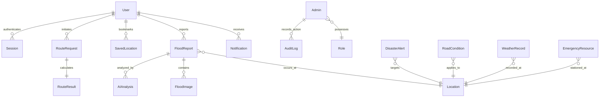

# FloodRoute AI — Enterprise Database Schema Specification

## 1. Overview
The FloodRoute AI datastore provides relational integrity, geospatial precision, and auditability across 19 normalized tables. The schema is defined with Prisma ORM and is dual-compatible with **PostgreSQL 16+** (for enterprise multi-node deployment) and **SQLite** (for zero-dependency local offline operation).

---

## 2. Entity-Relationship Overview

---

## 3. Detailed Data Dictionary (19 Tables)

### 3.1. Authentication & User Management
1. **`User`**:
   - `id` (String, PK, UUID): Unique identifier.
   - `email` (String, Unique): User's primary email.
   - `phone` (String, Optional): Verification and SMS alert contact.
   - `passwordHash` (String): Argon2 / bcrypt salt and hash.
   - `name` (String): Display identity.
   - `role` (String, Default 'CITIZEN'): `CITIZEN`, `SENTINEL`, `MODERATOR`, `ADMIN`.
   - `points` (Int, Default 0): Gamified sentinel contribution ranking.
   - `createdAt`, `updatedAt` (DateTime).

2. **`Admin`**:
   - `id` (String, PK, UUID): Administrator identifier.
   - `username` (String, Unique): Operator username.
   - `passwordHash` (String): Cryptographic password hash.
   - `roleId` (String, FK -> `Role.id`): Permissions link.
   - `department` (String): e.g. "State Disaster Management Authority".

3. **`Role`**:
   - `id` (String, PK): Role name (`SUPER_ADMIN`, `DISTRICT_OFFICER`, etc.).
   - `permissions` (String): Comma-separated or JSON array of allowable actions.

4. **`Session`**:
   - `id` (String, PK, UUID): Session identifier.
   - `token` (String, Unique): Cryptographic JWT signature token.
   - `userId` (String, FK -> `User.id`): Associated citizen.
   - `expiresAt` (DateTime): Expiration timestamp.

### 3.2. Geographic Foundations & Bookmarks
5. **`Location`**:
   - `id` (String, PK, UUID): Geographic entity ID.
   - `name` (String): Local place or street title.
   - `district` (String): Administrative district (e.g. Chennai, Kamrup, Mumbai Suburban).
   - `state` (String): Indian State / UT (e.g. Tamil Nadu, Assam, Maharashtra).
   - `latitude` (Float), `longitude` (Float): WGS84 decimal coordinates.
   - `elevation` (Float, Optional): Meters above Mean Sea Level.

6. **`SavedLocation`**:
   - `id` (String, PK, UUID): Bookmark ID.
   - `userId` (String, FK -> `User.id`): Owner.
   - `name` (String): Custom label (e.g. "Home", "Office", "Parents' House").
   - `latitude` (Float), `longitude` (Float).

### 3.3. Incident Reporting & Computer Vision
7. **`FloodReport`**:
   - `id` (String, PK, UUID): Report ID.
   - `reportCode` (String, Unique): Human-readable tracking tag (e.g. `FR-CHN-4091`).
   - `userId` (String, FK -> `User.id`, Optional for anonymous reports).
   - `locationId` (String, FK -> `Location.id`, Optional).
   - `latitude` (Float), `longitude` (Float): Precise GPS coordinates.
   - `locationName` (String): Geocoded text representation.
   - `waterLevel` (String): `ANKLE_DEEP`, `KNEE_DEEP`, `WAIST_DEEP`, `SUBMERGED`.
   - `severity` (String): `LOW`, `MEDIUM`, `HIGH`, `CRITICAL`.
   - `status` (String): `PENDING_REVIEW`, `VERIFIED`, `REJECTED`, `RESOLVED`.
   - `upvotes` (Int, Default 0): Community corroboration counter.
   - `reportedAt` (DateTime).

8. **`FloodImage`**:
   - `id` (String, PK, UUID): Image ID.
   - `reportId` (String, FK -> `FloodReport.id`): Parent report.
   - `imageUrl` (String): Storage path or CDN URL.
   - `isPrimary` (Boolean): Thumbnail selection.

9. **`AIAnalysis`**:
   - `id` (String, PK, UUID): Analysis ID.
   - `reportId` (String, FK -> `FloodReport.id`, Unique): Report binding.
   - `floodDetected` (Boolean): Binary computer vision classification.
   - `confidence` (Float): 0 to 100 confidence level.
   - `waterDepthCm` (Float, Optional): Estimated metric depth.
   - `vehicleAccessibility` (String): `ALL`, `SUVS_ONLY`, `HIGH_AXLE_ONLY`, `IMPASSABLE`.
   - `disclaimer` (String): Explaining advisory AI provenance.

10. **`CommunityReport`**:
    - Aggregated secondary crowdsourced feedback and confirmation markers.

### 3.4. Infrastructure & Disaster Alerts
11. **`RoadCondition`**:
    - `id` (String, PK, UUID): Road closure event ID.
    - `roadName` (String): National / State Highway or arterial road title.
    - `condition` (String): `PASSABLE`, `SLOW`, `WATERLOGGED`, `BLOCKED`.
    - `latitude` (Float), `longitude` (Float): Closure location.
    - `reason` (String): Explanation (e.g. "Culvert overflow, 2.5ft water depth").
    - `source` (String): `POLICE_CONTROL_ROOM`, `DISASTER_DESK`, `HIGHWAY_PATROL`.

12. **`DisasterAlert`**:
    - `id` (String, PK, UUID): Warning alert ID.
    - `title` (String): Advisory headline.
    - `description` (String): Protective guidance and evacuation advisories.
    - `severity` (String): `YELLOW`, `AMBER`, `RED`, `EMERGENCY`.
    - `sourceLabel` (String): Issuing authority (`NDMA`, `IMD`, `CWC`, `SDMA`).
    - `geometryGeoJSON` (String, Optional): Inundation polygon definition.
    - `effectiveTime`, `expiryTime` (DateTime).

13. **`EmergencyResource`**:
    - `id` (String, PK, UUID): Lifeline identifier.
    - `category` (String): `HOSPITAL`, `SHELTER`, `POLICE_STATION`, `FIRE_STATION`, `BOAT_DOCK`.
    - `name` (String): Facility designation.
    - `address` (String), `phone` (String).
    - `capacity` (Int, Optional), `occupied` (Int, Default 0).
    - `latitude` (Float), `longitude` (Float).

### 3.5. Hydrometeorology & Routing
14. **`WeatherCache`**: In-memory and persisted district weather forecasts.
15. **`WeatherRecord`**: Historical and realtime radar snapshots ($mm/h$, wind, barometric pressure).
16. **`WeatherAlert`**: Specialized meteorological bulletins from IMD radars.
17. **`RouteRequest`**: Origin, destination, preference constraints, and timestamp.
18. **`RouteResult`**: Safe vs fast geometry paths, flood exposure score, ETA differential.

### 3.6. Auditability & Notifications
19. **`Notification`**: Citizen push notifications and disaster broadcast dispatch.
20. **`AuditLog`**: Tamper-evident operator action trail with IP address and timestamps.
