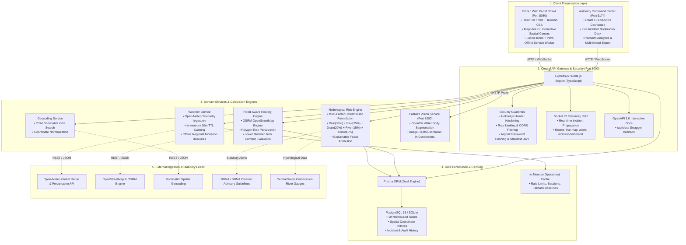

# FloodRoute AI — System Architecture Diagram

> End-to-end multi-layer architecture diagram depicting client interfaces, security gateway, microservices, data persistence, and external GIS/weather ingestion pipelines.

---

## 1. Complete Mermaid System Architecture



---

## 2. Text-Based Component Pipeline

```text
[Citizen User / Browser]                [Disaster Authority / Command Center]
       │                                                   │
       ▼                                                   ▼
┌────────────────────────────────────────────────────────────────────────┐
│                   API Gateway (Port 5000, Express + TS)                │
│   • JWT Auth / Argon2id   • Helmet Hardening   • Rate Limiting         │
│   • Socket.IO WebSocket Grid                   • OpenAPI / Swagger     │
└────────────────────────────────────┬───────────────────────────────────┘
                                     │
         ┌───────────────────────────┼───────────────────────────┐
         ▼                           ▼                           ▼
┌──────────────────┐       ┌──────────────────┐       ┌──────────────────┐
│ Weather & Geo    │       │ Hydrological     │       │ Routing Engine   │
│ Service          │       │ Risk Engine      │       │ (OSRM / Spatial) │
│ • Open-Meteo API │       │ • Multi-factor   │       │ • Road Penalties │
│ • Nominatim      │       │   Algorithm      │       │ • Safe Corridor  │
│ • Local Cache    │       │ • Factor Weights │       │   Evaluation     │
└────────┬─────────┘       └─────────┬────────┘       └────────┬─────────┘
         │                           │                         │
         └───────────────────────────┼─────────────────────────┘
                                     ▼
┌────────────────────────────────────────────────────────────────────────┐
│            Prisma ORM Layer (PostgreSQL 16 / SQLite Engine)            │
│  • 19 Relational Tables  • Spatial Indexes  • Zero-leak Safe Storage   │
└────────────────────────────────────┬───────────────────────────────────┘
                                     │
                                     ▼
┌────────────────────────────────────────────────────────────────────────┐
│           FastAPI Computer Vision Engine (Port 8000, Python)           │
│  • OpenCV Contour Segmentation  • Flood Depth Estimation (cm)          │
└────────────────────────────────────────────────────────────────────────┘
```
