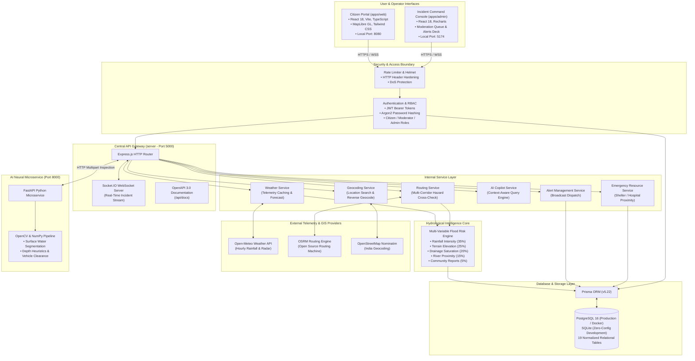
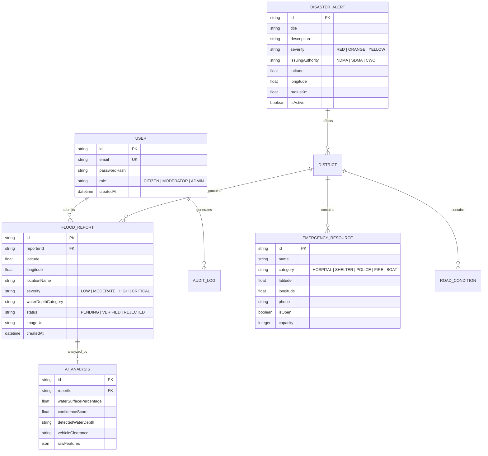

# FloodRoute AI — Technical Architecture & Engineering Deep-Dive

> Comprehensive architectural specification of the FloodRoute AI Platform.  
> Details end-to-end data pipelines, microservice boundaries, interface protocols, and database schema design.

---

## 1. System Architecture Diagram

---

## 2. Microservice Inventory & Boundary Definitions

### A. Citizen Web Portal (`apps/web` — Port 8080)
* **Framework**: React 18, Vite, TypeScript, Tailwind CSS.
* **Geospatial Engine**: MapLibre GL rendering OpenStreetMap tiles and custom GeoJSON vector layers.
* **Core Responsibilities**:
  * Public location search and current GPS geolocation.
  * Real-time spatial visualization of flood risk tiers, community hazard reports, and official alerts.
  * Multi-corridor route comparison with explicit "Lower modeled flood-risk exposure" labels.
  * Interactive 8-step Judge Demonstration modal.
  * Context-aware floating AI Copilot chat with voice input.

### B. Incident Command Admin Center (`apps/admin` — Port 5174)
* **Framework**: React 18, Vite, TypeScript, Tailwind CSS, Recharts.
* **Core Responsibilities**:
  * Live monitoring of incoming crowdsourced hazard reports with photo evidence.
  * Automated CV water-level verification approval workflow (`PENDING` $\to$ `VERIFIED` / `REJECTED`).
  * Statutory disaster alert orchestration and platform-wide WebSocket push.
  * Road closure status toggling (`PASSABLE`, `CAUTION`, `FLOODED`, `BLOCKED`).
  * District vulnerability analytics with one-click PDF, CSV, Excel, and JSON export.
  * Deep system health monitoring (`/api/system/health-deep`).

### C. Central API Gateway (`server` — Port 5000)
* **Framework**: Node.js 20+, Express.js, TypeScript, Prisma ORM 5.22.
* **Core Responsibilities**:
  * Central REST API endpoint router and rate limiting.
  * WebSocket broadcast hub using Socket.IO for real-time incident distribution.
  * Integration orchestrator for Open-Meteo, OSRM, and Nominatim.
  * Deterministic multi-variable flood risk calculation engine.
  * OpenAPI 3.0 / Swagger UI documentation at `/api/docs`.

### D. AI Computer Vision Service (`apps/ai-service` — Port 8000)
* **Framework**: Python 3.10+, FastAPI, Uvicorn, OpenCV (`cv2`), NumPy, Pillow.
* **Core Responsibilities**:
  * Color-space segmentation of standing water surfaces in user-submitted photos.
  * Turbidity and reflection edge analysis.
  * Vehicle wheel immersion heuristic estimation (Dry, Splashing, Wheel-Hub Depth, Axle Depth, Submerged).
  * Clearance advisory generation (Passable for Sedans vs SUV Recommended vs Impassable).

---

## 3. Data Flow & Communication Protocols

1. **Client to Gateway**: HTTP/2 with JSON payloads for REST transactions; persistent WebSockets (`wss://`) via Socket.IO for real-time telemetry events (`incident.new`, `report.verified`, `alert.broadcast`).
2. **Gateway to External APIs**:
   * **Weather**: REST calls to `api.open-meteo.com/v1/forecast` with in-memory TTL caching (10 minutes) to prevent rate limits.
   * **Routing**: REST calls to `router.project-osrm.org/route/v1/driving/` with fallback straight-line multi-point path generator.
   * **Geocoding**: REST calls to `nominatim.openstreetmap.org/search` with country code filtering (`in`).
3. **Gateway to AI Vision**: Internal HTTP POST multipart form transmission forwarding uploaded incident photos to `http://localhost:8000/api/analyze-flood`.
4. **Gateway to Database**: Native Prisma client connection pool interacting with PostgreSQL or SQLite.

---

## 4. Database Schema Entity Model (Key Relational Models)

---

## 5. Security & Reliability Architecture

* **Authentication & Authorization**: Stateless JWT tokens signed with SHA-256; role-based guard middleware isolating `/api/admin/*` routes to authorized operators.
* **Password Hashing**: Argon2 / bcrypt with high work factor.
* **Input Sanitization**: Zod schemas validate every inbound HTTP body, preventing SQL injection and buffer overrun vulnerabilities.
* **Zero-Secret Policy**: Strict exclusion of `.env` files via `.gitignore`; credentials managed via environment variables.
* **Fail-Safe Graceful Degradation**:
  * If Open-Meteo is unreachable, the platform serves cached or historical seasonal monsoon averages.
  * If OSRM is offline, a spatial great-circle interpolation corridor is computed with safety buffer warnings.
  * If PostgreSQL is unavailable locally, SQLite serves as a zero-configuration plug-and-play datastore.
