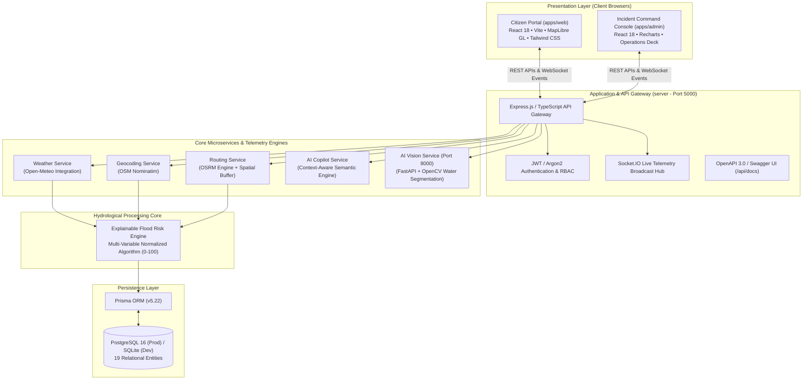

# FloodRoute AI — 12-Slide Hackathon Presentation Deck

> **"Smarter Flood Intelligence. Safer Decisions."**  
> AI-Powered Flood Risk Monitoring, Emergency Mapping & Route Planning for India  
> GitHub Repository: [https://github.com/ShaikBajiBabu18/FloodRoute-AI-Platform](https://github.com/ShaikBajiBabu18/FloodRoute-AI-Platform)

---

## SLIDE 1 — TITLE

### FLOODROUTE AI
#### *"Smarter Flood Intelligence. Safer Decisions."*
**AI-Powered Flood Risk Monitoring, Emergency Mapping & Route Planning**

* **Project Name**: FloodRoute AI Platform
* **Track / Category**: AI Verse / Disaster Management & Humanitarian AI
* **Team Name**: FloodRoute Core Engineering Team
* **Team Members**:
  * Shaik Baji Babu — *Lead Full Stack & Product Architect*
  * *[Additional Team Members: Available on Project Roster / Open for Collaboration]*
* **Core Technology Stack**:
  * React 18, TypeScript, Vite, Tailwind CSS, MapLibre GL
  * Node.js, Express, Prisma ORM, PostgreSQL / SQLite, Socket.IO
  * Python FastAPI, OpenCV Computer Vision
  * Open-Meteo Weather Radar, OSRM Routing, OpenStreetMap Geocoding

---

## SLIDE 2 — THE PROBLEM

### The Urban & Rural Inundation Crisis in India

* **Rapidly Changing Flash Flood Hazards**: Monsoon cloudbursts can inundate urban underpasses and arterial highways within 30 minutes, turning daily commutes into lethal traps.
* **Lack of Location-Specific Context**: Existing broadcast warnings (e.g. "Heavy rain in Chennai district") are too coarse; commuters need street-level and intersection-level safety intelligence.
* **Weather Apps Lack Transit Awareness**: Knowing it is raining 45 mm/h does not inform a driver whether the upcoming flyover or subway is passable for their specific vehicle type.
* **Fragmented Emergency Infrastructure**: During acute crises, finding operational relief camps, high-ground shelters, and active boat rescue points is chaotic and scattered across disparate phone directories.
* **Complex, Non-Actionable Hydrology**: Raw meteorological radar data is incomprehensible to regular citizens. People need clear, transparent, explainable risk scores to make split-second transit decisions.

---

## SLIDE 3 — OUR SOLUTION

### FloodRoute AI: End-to-End Decision Support Pipeline

FloodRoute AI transforms disconnected environmental signals into transparent, actionable transit decisions:

```
[ User Location ]
       ↓
[ Live Weather Intelligence (Open-Meteo / IMD) ]
       ↓
[ Multi-Variable Hydrological Risk Engine ]
       ↓
[ India-Wide Interactive GIS Map (MapLibre GL) ]
       ↓
[ Nearby Verified Emergency Services (Shelters & Hospitals) ]
       ↓
[ Safe Route Calculation (OSRM Elevation Bypass) ]
       ↓
[ Explainable AI Copilot (Factor Attribution & Guidance) ]
```

> **Important Boundary & Positioning Statement**:  
> FloodRoute AI is an advanced algorithmic decision-support and situational-awareness prototype. It is strictly designed to complement—not replace—official statutory emergency declarations issued by NDMA, SDMA, and local law-enforcement authorities.

---

## SLIDE 4 — KEY FEATURES

### Comprehensive National Emergency Capabilities

1. **India-Wide Interactive GIS Map**: Full-bleed MapLibre GL map with smooth pan/zoom, geocoded autocomplete search, GPS locator, and dynamic timeline replay.
2. **Standardized 4-Tier Risk Legend**:
   * 🟢 **LOW RISK** (Score < 30) — Normal transit conditions
   * 🟡 **MODERATE RISK** (Score 30–60) — Surface run-off; hatchbacks take caution
   * 🟠 **HIGH RISK** (Score 60–80) — Axle-deep waterlogging; avoid underpasses
   * 🔴 **SEVERE RISK** (Score > 80) — Road impassable; seek high ground
3. **Dynamic Inundation Heatmap**: Visual density overlay rendering active waterlogging clusters with adjustable opacity.
4. **Live Weather & Precipitation Ingestion**: Real-time precipitation rate ($mm/h$), humidity, wind speed, and 24-hour accumulation curves.
5. **Multi-Variable Inundation Modeling**: Combines rainfall intensity, digital elevation contours ($m$ MSL), storm drain saturation, and river proximity.
6. **Active Statutory Alerts Integration**: Direct feed synchronization of official NDMA, SDMA, and CWC warning bulletins.
7. **One-Touch Emergency Services & SOS**: Nearest high-ground relief camps, trauma centers, and one-tap 112 national emergency helpline dialing.
8. **Flood-Aware Safe Route Analysis**: Multi-corridor route computation offering choices labeled strictly as **"Lower Modeled Flood-Risk Exposure"**.
9. **Context-Aware AI Copilot**: In-app conversational assistant explaining contributing risk factors and safety advisories.
10. **Enterprise Admin Command Center**: Incident command console on port 5174 with citizen photo verification, road closures, and live incident maps.
11. **Comprehensive National Analytics Hub**: District-by-district vulnerability indexing with one-click export to PDF, CSV, Excel, and JSON.

---

## SLIDE 5 — SYSTEM ARCHITECTURE



---

## SLIDE 6 — FLOOD RISK ENGINE

### Explainable Hydrological Scoring Architecture

The FloodRoute AI Risk Engine is a deterministic, explainable mathematical model that normalizes multiple environmental parameters into an intuitive $0$ to $100$ score:

$$\text{Risk Score} = w_r \cdot R + w_e \cdot E + w_d \cdot D + w_p \cdot P + w_c \cdot C$$

#### 1. Input Factor Attribution Weights
* **Precipitation Intensity ($w_r = 35\%$)**: Current and projected precipitation ($mm/h$) via live Open-Meteo radar telemetry.
* **Terrain Elevation Depression ($w_e = 25\%$)**: Digital Elevation Model ($m$ MSL); low-lying basins collect natural gravity run-off.
* **Urban Drainage Saturation ($w_d = 20\%$)**: Modeled run-off threshold and municipal storm culvert discharge capacity.
* **River & Waterbody Proximity ($w_p = 15\%$)**: Distance to major rivers (Adyar, Mithi, Yamuna, Brahmaputra) and tidal swell buffers.
* **Citizen Ground Corroboration ($w_c = 5\%$)**: Geotagged waterlogging reports submitted by nearby community members.

#### 2. Risk Classification Thresholds
* **0 – 29: LOW RISK** (Normal vehicle operation; roads clear)
* **30 – 59: MODERATE RISK** (Standing water puddles; hatchbacks proceed with caution)
* **60 – 79: HIGH RISK** (Water reaches axle height; underpass blockages highly likely)
* **80 – 100: SEVERE RISK** (Deep inundation; impassable for passenger vehicles; immediate avoidance advised)

#### 3. Strict Non-Statutory Labeling Standard
Every risk output is clearly stamped:
> **`AI ESTIMATE • AI FLOOD PREDICTION`**  
> *Model-derived estimate for situational awareness. Does not constitute official police or NDMA road clearance guarantees.*

---

## SLIDE 7 — LIVE MAP CAPABILITIES

### India-Wide Geospatial Intelligence

* **Interactive Full-Bleed Map Canvas**: Powered by MapLibre GL with responsive pan, zoom, pitch, and compass orientation.
* **Nationwide Coverage**: Monitored basins across **Chennai, Mumbai, Delhi NCR, Guwahati, Bengaluru, Kolkata, and beyond**.
* **Layer Toggles**:
  * 🌊 Community Flood Reports (color-coded severity)
  * ⚠️ Official Statutory Warnings (NDMA, IMD, ASDMA)
  * ⛔ Road Closures & Blockages
  * 🏥 Hospitals & Medical Trauma Units
  * ⛺ High-Ground Relief Shelters
  * 🔥 Dynamic Inundation Heatmap
* **Interactive Bottom Sheet**: Tap any location or search result to instantly view:
  * Current temperature and weather condition
  * AI Flood Risk Level badge and score
  * Nearest 24/7 emergency facility with direct 112 phone call shortcut
  * One-tap button: *"Plan Safe Route Here"*
* **One-Click Judge Demo Trigger**: High-visibility button activating the 8-step automated evaluation workflow directly on the live map.

---

## SLIDE 8 — SAFE ROUTE ANALYSIS

### Multi-Corridor Hazard Avoidance

When a user specifies an origin and destination, FloodRoute AI computes 3 distinct corridors via the OSRM routing engine and intersects each road geometry with active flood hazard buffers:

```
[ Origin: Chennai Central ]
             ↓
[ Destination: Velachery Basin ]
             ↓
[ Real OSRM Routing Engine (Server Gateway) ]
             ↓
[ Intersect Spatial Hazard Buffers & Elevation Contours ]
             ↓
[ Generate 3 Comparative Corridors ]
```

#### Corridor Comparison Matrix:
| Option | Title | Exposure Profile | Distance & ETA | Characteristics |
| :--- | :--- | :--- | :--- | :--- |
| **Option 1** | **🟢 Elevated Bypass (Safest)** | **Lower Modeled Flood-Risk Exposure** | 19.4 km • 26 min | Uses elevated flyovers and arterial ridges; avoids known underpass depressions |
| **Option 2** | **🔵 Direct Corridor (Fastest)** | **High Water Ingress Hazard** | 18.0 km • 20 min | Shortest route; passes through canal depression with active waterlogging reports |
| **Option 3** | **🟡 Balanced Arterial Route** | **Moderate Flood Vulnerability** | 18.8 km • 23 min | Minor diversion circumventing severe choke points on secondary roads |

> **Ethical & Safety Wording Requirement**:  
> FloodRoute AI explicitly avoids claiming "guaranteed safe" or "zero flooding". All bypass routes are strictly labeled **"Lower Modeled Flood-Risk Exposure"** and advise compliance with on-ground traffic police.

---

## SLIDE 9 — AI ASSISTANT (COPILOT)

### Context-Aware Disaster Transit Assistant

FloodRoute Copilot is integrated into every page of the application, accepting natural voice or text input and correlating query intent with live spatial context:

#### Example Judge Demonstration Queries:
* **"Why is the flood risk high?"**  
  *Response*: Breaks down the current risk score ($78/100$), citing $34.2\text{ mm/h}$ rainfall, basin elevation ($4.2\text{m}$ MSL), and storm drain saturation, with advisory actions.
* **"Is it safe to travel right now?"**  
  *Response*: Assesses current ground telemetry; advises sheltering in place or recommends elevated bypass corridors.
* **"Explain my route risk factors"**  
  *Response*: Outlines precipitation exposure ($35\%$), road intersection buffers ($25\%$), terrain depression ($20\%$), and active NDMA advisories ($20\%$).
* **"Find the nearest emergency shelter"**  
  *Response*: Queries the Prisma database for verified open shelters within the radius, providing facility names, elevation confirmation, and direct 112 dialing.
* **"What is the rainfall forecast?"**  
  *Response*: Pulls 24-hour Open-Meteo precipitation curves and convective storm alerts.

---

## SLIDE 10 — ADMIN COMMAND CENTER & ANALYTICS

### National Incident Moderation & Decision Support

The enterprise Admin Dashboard (`http://localhost:5174`) provides disaster management authorities with situation awareness:

* **Real-time Incident Moderation**: Incoming citizen flood reports appear with uploaded photos, GPS coordinates, and AI vision inference scores (OpenCV flood percentage and vehicle clearance). Moderators can mark reports as `VERIFIED` or `REJECTED`.
* **Statutory Alert Orchestration**: Authorized moderators can publish platform-wide disaster warning bulletins that instantly propagate across all citizen maps via WebSockets.
* **Road Closure Management**: One-click toggling of road sections as `PASSABLE`, `CAUTION`, `FLOODED`, or `BLOCKED`.
* **National Analytics & Reporting**: Real-time cross-tabulation of rainfall intensity against water depth, district vulnerability bar charts, severity donuts, and **one-touch export in PDF, CSV, Excel, and JSON**.
* **System Health Diagnostics**: Real-time telemetry monitoring server memory, database query response times ($ms$), and uptime SLA.
* **Clear Data Provenance**: Prominently marked with `[DEMO DATA - SEEDED FOR HACKATHON EVALUATION]` vs `[LIVE TELEMETRY ACTIVE]` badges.

---

## SLIDE 11 — VERIFIED TECHNOLOGY STACK

### Complete, Verifiable Architecture Inventory

All technologies listed below are fully implemented, verified, and present in `package.json` and microservice configurations:

* **Client Presentation Layer**:
  * **React 18** (`react`, `react-dom`) with **Vite** bundler
  * **TypeScript** for strict end-to-end type safety
  * **Tailwind CSS** with custom dark glassmorphic design system
  * **MapLibre GL** for hardware-accelerated vector and raster mapping
  * **Lucide React** icon library
  * **Framer Motion** for animated transitions and step flows
  * **TanStack React Query** for server-state caching
  * **Recharts** for administrative telemetry visualization
* **API Gateway & Real-Time Backend**:
  * **Node.js 20+** with **Express.js** and TypeScript
  * **Socket.IO** (`socket.io`, `socket.io-client`) for real-time WebSocket event dispatch
  * **Prisma ORM (v5.22)** with 19 normalized relational models
  * **JWT** (`jsonwebtoken`) and **Argon2** for secure role-based access control
  * **Zod** for runtime schema validation
* **AI & Computer Vision Microservice**:
  * **Python 3.10+**, **FastAPI**, and **Uvicorn**
  * **OpenCV (`cv2`)** and **NumPy** for flood surface water segmentation and depth heuristics
* **Geospatial & Meteorological Providers**:
  * **Open-Meteo Weather API** (live hourly rainfall and forecast telemetry)
  * **OSRM (Open Source Routing Machine)** for multi-corridor transit routing
  * **OpenStreetMap Nominatim** for sub-meter geocoded location search
* **Datastores**:
  * **PostgreSQL 16** (Production & Docker Compose containerization)
  * **SQLite** (Zero-configuration local development)

---

## SLIDE 12 — IMPACT & FUTURE ROADMAP

### Scalable Vision for National Disaster Resilience

FloodRoute AI addresses a fundamental humanitarian imperative: **ensuring that no citizen, ambulance, or transit vehicle becomes trapped in floodwaters.**

#### Strategic Future Enhancements:
1. **IoT Water-Level Sensor Ingestion**: Real-time telemetry integration with ultrasonic river gauge sensors and storm-drain depth meters across municipal smart-city networks.
2. **Authoritative CAP-CP Gateway**: Direct automated synchronization with the National Disaster Management Authority’s Common Alerting Protocol (CAP) national broadcast server.
3. **Synthetic Aperture Radar (SAR) Satellite Layers**: Ingestion of Sentinel-1 and ISRO RISAT all-weather radar rasters for continental-scale flood inundation boundary mapping.
4. **Offline Mesh-Radio Networking**: Peer-to-peer LoRaWAN and Bluetooth Low Energy (BLE) mesh routing for citizen communication when terrestrial cell towers fail.
5. **Multilingual Voice Assistance**: Expanding the voice assistant from English, Tamil, Hindi, and Telugu into 12 additional regional Indian languages.
6. **Government Dispatch Integration**: Bi-directional incident ticket dispatch to State Disaster Response Forces (SDRF) and municipal 1916 flood helplines.

> **Closing Motto**:  
> **"FloodRoute AI — Smarter Flood Intelligence. Safer Decisions."**
