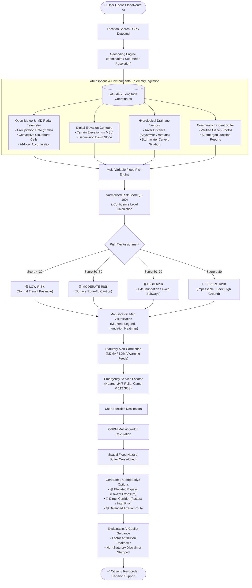
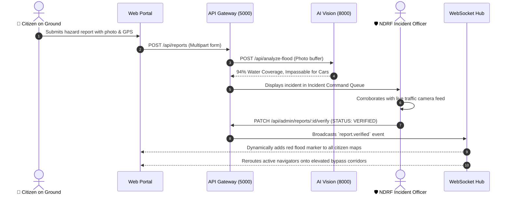

# FloodRoute AI — System Flowchart & User Journey Mapping

> Complete visual specifications detailing the end-to-end algorithmic decision pipeline and step-by-step citizen interaction journey.

---

## 1. System Engineering Flowchart

This flowchart illustrates how raw environmental, geographical, and meteorological data streams pass through FloodRoute AI's processing stages to produce actionable citizen guidance.

---

## 2. End-to-End Citizen User Journey

The 10-step user experience journey designed for intuitive, accessible crisis navigation:

```mermaid
flowchart LR
    S1["1. Open FloodRoute<br/>(Homepage/PWA)"] --> S2["2. Search Location<br/>(City or Address)"]
    S2 --> S3["3. Select Location<br/>(Velachery Basin)"]
    S3 --> S4["4. View Weather<br/>(34.2 mm/h Rain)"]
    S4 --> S5["5. Analyze Flood Risk<br/>(78/100 HIGH RISK)"]
    S5 --> S6["6. View Alerts<br/>(NDMA Orange Watch)"]
    S6 --> S7["7. Find Emergency<br/>(Relief Camp 1.2km)"]
    S7 --> S8["8. Enter Destination<br/>(Target Office / Home)"]
    S8 --> S9["9. Analyze Route<br/>(Elevated Bypass)"]
    S9 --> S10["10. Review AI Explanation<br/>(Factor Breakdown)"]
```

### Detailed Breakdown of Each Step

| Step | User Action | System Execution | Output Displayed |
| :--- | :--- | :--- | :--- |
| **1. Open FloodRoute** | Navigates to `http://localhost:8080` on mobile or desktop browser. | Initializes service worker, loads local telemetry cache, and establishes WebSocket stream. | High-contrast hero landing page with active India Flood Safety network ribbon. |
| **2. Search Location** | Enters query in large search bar (e.g. *"Velachery"* or *"Kurla West"*). | In-memory debounced query hits geocoding router with country bounding. | Autocomplete dropdown with sub-meter location suggestions. |
| **3. Select Location** | Clicks on desired search suggestion or taps GPS *"My Location"*. | Map centers dynamically with smooth camera flyTo animation. | Full-screen interactive map with color-coded risk markers and active alert ribbons. |
| **4. View Weather** | Inspects weather card on landing dashboard or weather page. | Open-Meteo REST service delivers current temperature, rainfall rate, humidity, and wind. | 29°C, Heavy Rain (34.2 mm/h), 24h accumulation curve. |
| **5. Analyze Flood Risk** | Clicks *"Run Flood Risk Analysis"* or inspects bottom location sheet. | Multi-variable hydrological engine processes precipitation, elevation, and drainage. | **78/100 High Risk** gauge with vehicle passability clearance advisory. |
| **6. View Alerts** | Taps alert notification card or disaster alert tab. | System cross-references active NDMA and SDMA regional bulletins. | Active Orange Warning bulletin with safety instructions. |
| **7. Find Emergency Services** | Taps nearest shelter card or SOS emergency trigger. | Queries nearest high-elevation relief shelter with verified electrical/food provisions. | Guru Nanak College (1.2 km away) with instant 112 dial button. |
| **8. Enter Destination** | Opens Route Planner and enters final destination. | Dual geocoded origin and destination coordinates are packaged for transit calculation. | Route input preview with Car, Bike, or Walking vehicle toggle. |
| **9. Analyze Route** | System calculates optimal paths via OSRM and intersects hazard buffers. | Renders 3 comparative corridors with distance, ETA, and risk exposure profiles. | **🟢 Elevated Bypass (Safest)** recommended with *Lower modeled flood-risk exposure*. |
| **10. Review AI Explanation** | Opens Copilot Chat or reviews Explainable Factor card. | Transparent mathematical factor weighting displays why the risk and route were chosen. | Percentage contribution breakdown (35% rain, 25% elevation, 20% drainage, 15% river). |

---

## 3. Incident Management & Operator Life-Cycle

For municipal operators and disaster management officials:

