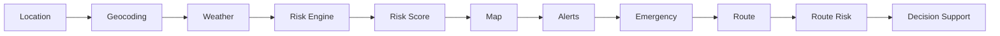
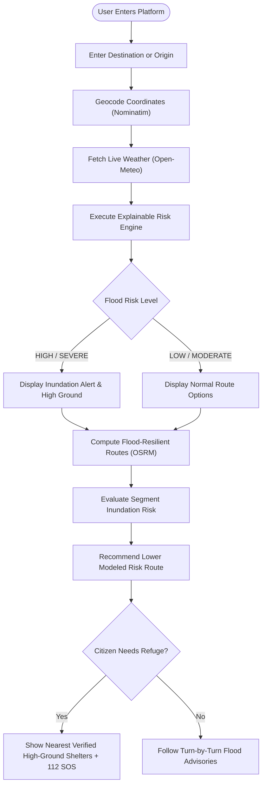

# FloodRoute AI — End-to-End System Flowchart

> Algorithmic data flow mapping raw geographic queries to life-saving decision support.

---

## 1. Core End-to-End Algorithmic Flow

### Detailed Pipeline Stage Descriptions

| Stage | Operation | System Component | Description |
| :---: | :--- | :--- | :--- |
| **1. Location** | GPS coordinate or query input | Citizen UI / Geolocation API | User selects or searches an Indian locality (e.g. Velachery, Chennai). |
| **2. Geocoding** | Address to lat/lon normalization | Nominatim / OSM Geocoder | Resolves search query into high-precision latitude/longitude coordinates. |
| **3. Weather** | Real-time hydrometeorology | Open-Meteo Weather API | Ingests precipitation rate ($mm/h$), 24h accumulation, and cloudburst factors. |
| **4. Risk Engine** | Deterministic multi-factor modeling | FloodRiskService (`server`) | Ingests rain ($35\%$), elevation ($25\%$), drainage ($20\%$), river ($15\%$), and crowd reports ($5\%$). |
| **5. Risk Score** | Normalization & classification | Risk Attribution Engine | Produces 0–100 score and assigns tier: LOW, MODERATE, HIGH, or SEVERE. |
| **6. Map** | Interactive spatial visualization | MapLibre GL / Vector Canvas | Renders localized risk heatmaps, hazard buffers, and road status overlays. |
| **7. Alerts** | Statutory hazard synchronization | DisasterAlertService | Pulls contextual NDMA / IMD Red/Amber warnings and safety directives. |
| **8. Emergency** | High-ground shelter indexing | EmergencyResourceService | Surfaces verified high-ground relief centers, NDRF camps, and 112 quick-dial. |
| **9. Route** | Topological pathfinding | OSRM / OpenStreetMap | Calculates primary and alternative transit corridors between origin & destination. |
| **10. Route Risk** | Polyline segment risk sampling | RouteRiskEvaluator | Samples waypoints along candidate polylines against flood inundation surfaces. |
| **11. Decision Support** | Transparent advisory recommendation | DecisionSupportEngine | Recommends the corridor with **Lower Modeled Flood-Risk Exposure** with full disclaimers. |

---

## 2. Interactive User Decision Flowchart

